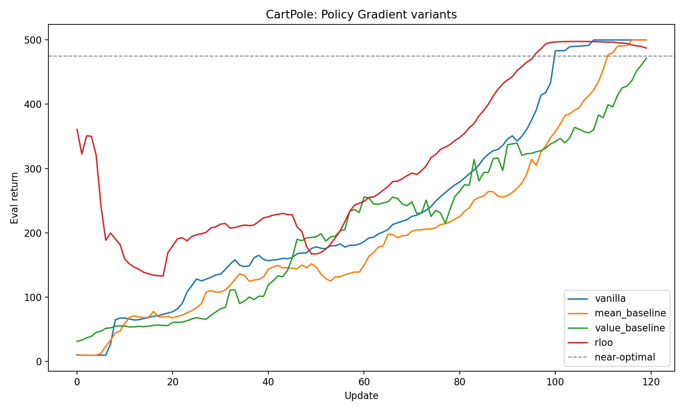
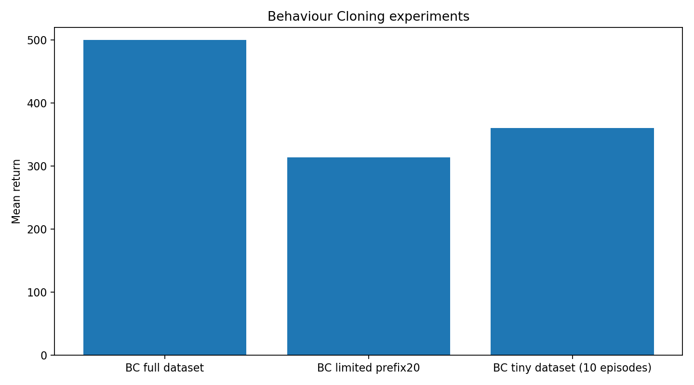

<div align="center">

<h1>🧠 Reinforcement Learning from Scratch — Pure NumPy</h1>

**Policy gradients & behavior cloning with a hand-written CartPole, hand-written Adam, and hand-written backprop — no PyTorch, no gym, no autograd.**


</div>

---

## TL;DR

A single self-contained notebook that implements deep RL **entirely from first principles in NumPy**:

- a custom **CartPole** environment (physics integrated by hand),
- an MLP **policy** and MLP **value** network,
- a **hand-written Adam** optimizer and manual **backprop** (no automatic differentiation),
- **policy gradient** with four variance-reduction schemes — `vanilla`, `mean_baseline`, `value_baseline`, `rloo`,
- a **behavior cloning** study with a dataset-size ablation (`full` / `prefix20` / `tiny-10eps`).

The goal is pedagogical: every gradient in this repo is derived and coded by hand, so the mechanics of policy gradients and imitation learning are fully visible.

## 🎯 What's inside

| Component | Details |
|---|---|
| **Environment** | `CartPoleEnv` — classic cart-pole dynamics (gravity, pole mass/length, semi-implicit Euler), 500-step episodes, reward `+1` per step |
| **Policy network** | `MLPBinaryPolicy` — `4 → 32 → 1` MLP, `tanh` hidden, Bernoulli action via `sigmoid(logit)` |
| **Value network** | `MLPValue` — `4 → 32 → 1` MLP used as a learned baseline |
| **Optimizer** | `Adam` — bias-corrected first/second moments, written from scratch on plain dicts of NumPy arrays |
| **PG variants** | `vanilla`, `mean_baseline` (EMA of returns), `value_baseline` (learned `V(s)`), `rloo` (leave-one-out over episodes) |
| **Regularization** | entropy bonus with a linear schedule (`0.01 → 0.0`), advantage normalization |
| **Imitation** | `train_bc` — collect expert `(state, action)` pairs, train a fresh policy with BCE |

## 📊 Results

<div align="center">


</div>

**Policy gradient (deterministic eval, 20 episodes, seed 42 run — `results_week1/summary.json`):**

| Variant | Final eval return |
|---|---|
| `vanilla` | **500.0** |
| `mean_baseline` | **500.0** |
| `value_baseline` | 471.6 |
| `rloo` | 487.5 |

All four variants learn to (near-)solve CartPole (max return 500). They differ mainly in stability and variance of the gradient, not in final ceiling.

**Behavior cloning ablation (deterministic eval, 40 episodes):**

| Dataset | Size (state-action pairs) | Eval return |
|---|---|---|
| `full` | 99,745 | **500.0** |
| `prefix20` (truncated coverage) | 4,000 | 313.5 |
| `tiny` (10 episodes) | 5,000 | 360.4 |

BC matches the expert on the full dataset but degrades sharply when state coverage is limited — the classic distribution-shift / covariate-shift failure mode of naive imitation.

> ### ⚠️ Seed sensitivity caveat
> This project ships **two** summary files that **disagree**, and that disagreement is the point:
> - `results_week1/summary.json` — best variant `vanilla` (500.0), all variants ≥ 471.
> - `results_week1_notebook/summary.json` — best variant `value_baseline` (494.5), while `vanilla` collapses to **226.75** and `rloo` to 305.1.
>
> Same config, same seed field (42) — but the runs land in very different basins. Single-seed policy-gradient numbers on CartPole are **not** reliable rankings; treat them as illustrative and average over seeds before drawing conclusions.

## 🔁 Reproduce

```bash
git clone https://github.com/simeonkolchin/rl-from-scratch-numpy.git
cd rl-from-scratch-numpy
pip install -r requirements.txt
jupyter notebook HW_Week1_AI.ipynb
```

Run the notebook top to bottom. The training cells regenerate `results_week1_notebook/summary.json`; the PNGs under `results_week1/` are the reference figures referenced above.

## 📚 Documentation

- [`docs/methods.md`](docs/methods.md) — derivations and implementation notes: CartPole dynamics, the from-scratch Adam, the four PG estimators, and the BC setup.

## 🛠 Stack

`NumPy` · `Matplotlib` · `Jupyter`

## 🧑‍💻 Contributing

Contributions and questions are welcome — see [CONTRIBUTING.md](CONTRIBUTING.md).

## 📄 License

MIT — see [LICENSE](LICENSE).

---

<sub>Coursework note: originally written for an "Selected Topics in AI" course (Week 1). Notebook narration was in Russian; this README and the docs are an English write-up of the same work.</sub>
