# Studying the Geometry of Toy Model

## Что сделано

В работе реализованы:

- минимальная `numpy`-реализация Toy Model, tied-weight автоэнкодера и Vanilla SAE в файле `toy_sae.py`;
- воспроизводимый сценарий экспериментов `run_experiments.py`, который прогоняет части 1–3, сохраняет графики и таблицы;
- набор артефактов в `artifacts/figures` и `artifacts/results`.

Ключевая цель работы была не перебрать максимальное число конфигураций, а изолировать несколько содержательных гипотез и проверить их на небольших, но репрезентативных sweep'ах.

## Сетап

Использовался сетап из условия:

- вероятности активации фичей задаются степенным законом `p_i = C * i^{-alpha}`;
- маска `m_i ~ Bernoulli(p_i)`, магнитуда `a_i ~ U(0, 1)`, активация `f_i = m_i * a_i`;
- скрытое состояние получается как `h = fW`, где `W in R^{F x d}`;
- реконструкция Toy Model: `f_hat = ReLU(hW^T + b)`;
- SAE: `z = ReLU(hW_enc + b_enc)`, `h_hat = zW_dec + b_dec`;
- функция качества SAE: `EV = 1 - sqrt(Var(h - h_hat) / Var(h))`.

Практические решения для стабильного обучения:

- в Toy Model вектор важностей `I` был зафиксирован равным `1`, так как в задании не было отдельного исследовательского вопроса про неравные важности;
- в SAE после каждого шага нормировались строки декодера: это убирает тривиальное перетягивание масштаба между `W_dec` и `z` при `L1`-штрафе;
- для оценки восстановления истинных фичей декодер SAE сопоставлялся с истинными эмбеддингами через Hungarian matching по cosine similarity;
- для восстановления частот использовался лучший порог на латенте по валидационному `F1`, чтобы не путать качество восстановления с произвольным масштабом латента.

## Часть 1

### Вопрос

Как изменение параметров модели влияет на структуру и геометрию эмбеддингов фичей и скрытых состояний?

### Гипотезы

1. При росте `F / d` superposition усилится: эмбеддинги начнут сильнее переиспользовать направления, а средний cosine между ними вырастет.
2. При росте `alpha` большая часть tail-фичей станет почти неразличимой по нормам, а hidden states станут более анизотропными.
3. Основная геометрическая организация возникает рано, а поздние шаги в основном донастраивают уже найденную конфигурацию.

### Дизайн эксперимента

- Sweep по `alpha`: `alpha in {0.3, 1.0, 2.0}`, `F = 24`, `d = 2`, `E[||f||_0] = 3.0`, 3 сида.
- Sweep по уровню superposition: `F in {12, 24, 48}`, `d = 4`, `alpha = 1.2`, `E[||f||_0] = 2.5`, 3 сида.
- Динамика обучения: одна модель с `F = 24`, `d = 2`, `alpha = 1.2`, снапшоты на шагах `0`, `50`, `200`, `2000`.

### Результаты

Геометрия при разных `alpha`:

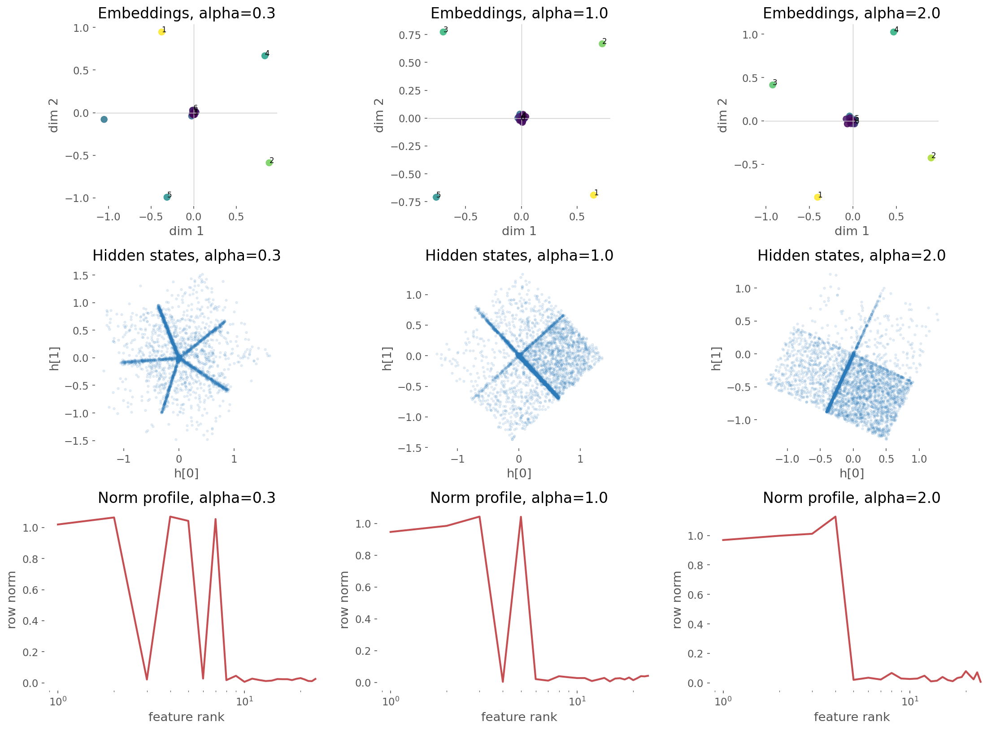

Сводка по sweep'у `alpha`:

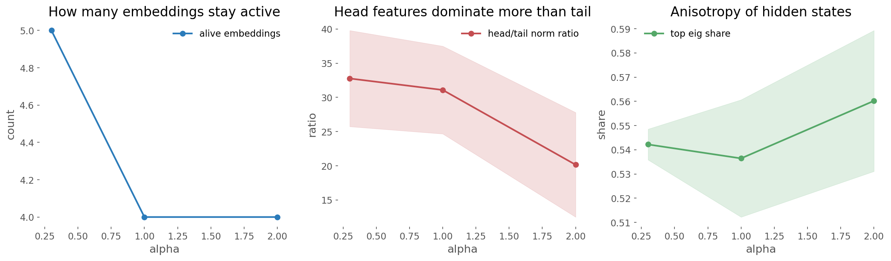

Сводка по уровню superposition:

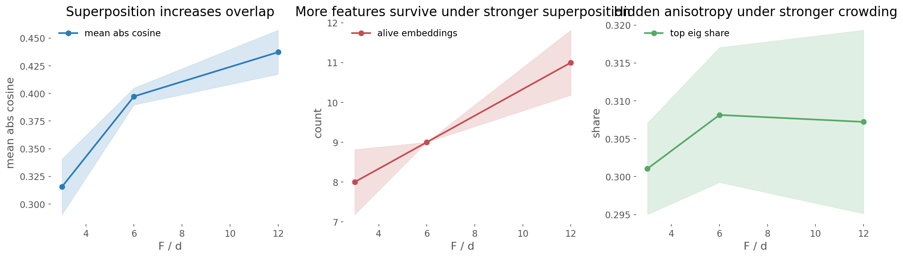

Динамика обучения Toy Model:

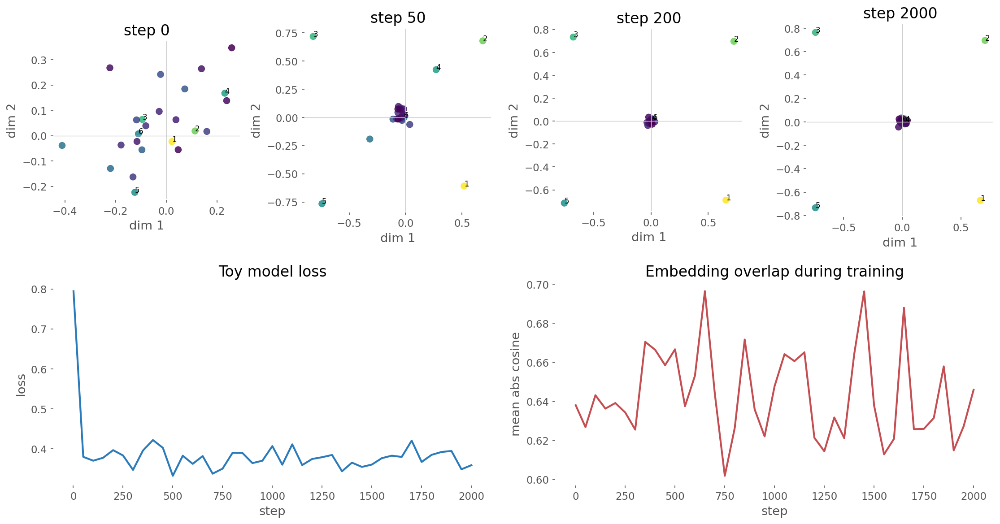

Наблюдения:

- В двумерном случае модель стабильно оставляет крупными только 4–5 эмбеддингов, а остальные строки `W` уходят почти в ноль. Это хорошо видно на `alpha_geometry.png`.
- При росте `alpha` число реально "живых" эмбеддингов уменьшается с `5.0` до `4.0`, а доля дисперсии hidden states в первой главной компоненте остаётся высокой и немного растёт: `0.542 -> 0.536 -> 0.560`.
- Эффект `alpha` оказался заметным, но не доминирующим: он скорее меняет то, какие именно head-фичи получают "свои" направления, чем полностью перестраивает геометрию.
- Уровень superposition влияет намного сильнее и чище: при `F / d = 3 -> 6 -> 12` средний `|cos|` между эмбеддингами растёт как `0.316 -> 0.397 -> 0.437`.
- Одновременно растёт и число ненулевых строк `W`: `8.0 -> 9.0 -> 11.0`. То есть при более жёсткой нехватке размерности модель не убивает tail полностью, а заставляет больше фичей делить одни и те же направления.
- Основная перестройка геометрии происходит очень рано. К шагу `200` видно почти финальную конфигурацию лучей и кластеров hidden states; дальше loss ещё падает, но визуальная конфигурация уже почти не меняется.

### Вывод по части 1

Главный фактор, определяющий геометрию, это не столько `alpha`, сколько соотношение `F / d`. Чем сильнее superposition, тем больше overlap между эмбеддингами и тем сильнее несколько фичей вынуждены делить одни и те же направления. Параметр `alpha` в исследованном диапазоне скорее перераспределяет приоритет между head- и tail-фичами, делая hidden space немного более анизотропным. Обучение Toy Model быстро организует крупномасштабную геометрию, а поздние шаги в основном шлифуют её.

## Часть 2

### Вопрос

От чего зависит качество обучения SAE, выраженное в `EV`, на различных конфигурациях модели?

### Гипотезы

1. Главный контроллер `EV` в Vanilla SAE — коэффициент sparsity penalty, а не ширина словаря сама по себе.
2. Если latent dictionary уже не слишком узкий, дальнейшее расширение даёт небольшой выигрыш.
3. Геометрия Toy Model влияет на `EV`, но слабее, чем гиперпараметры самого SAE.

### Дизайн эксперимента

- Базовый sweep SAE: `latent_dim in {8, 12, 24, 48}`, `l1 in {0, 0.01, 0.03, 0.1, 0.3, 1.0}`, baseline Toy Model `F = 24`, `d = 4`, `alpha = 1.2`, `E[||f||_0] = 2.5`, 3 сида.
- Кривые обучения SAE для `l1 in {0.01, 0.03, 0.1, 0.3}`.
- Sweep по параметрам модели: `d in {2, 4, 6}`, `E[||f||_0] in {1.5, 2.5, 4.0}`, фиксированные параметры SAE `latent_dim = 24`, `l1 = 0.1`, 3 сида.

### Результаты

Тепловая карта `EV` на baseline-конфигурации:

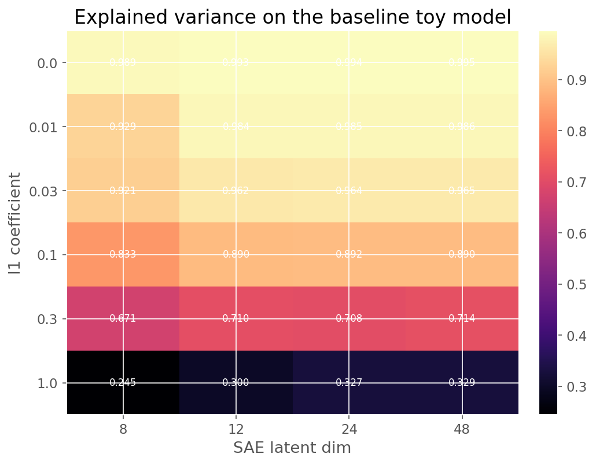

Кривые обучения SAE:

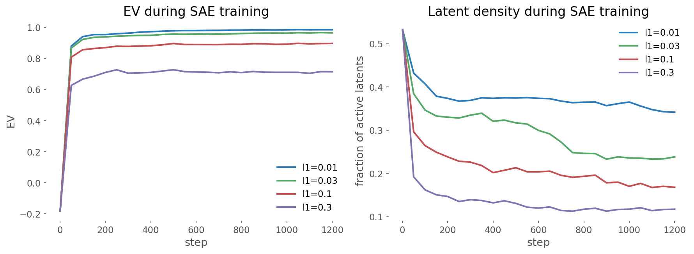

`EV` как функция параметров модели:

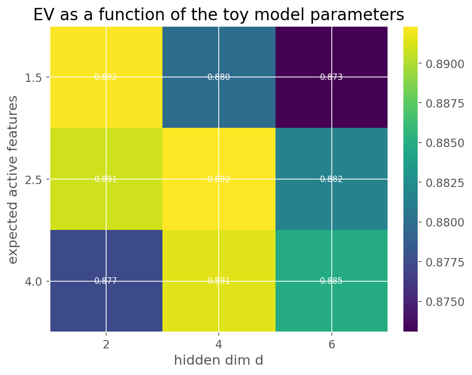

Связь `EV` с геометрическими свойствами:

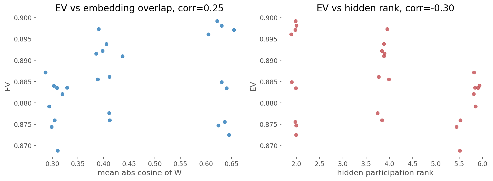

Наблюдения:

- Зависимость от `l1` очень сильная. Для `latent_dim = 24` получаем `EV = 0.994` при `l1 = 0`, `0.985` при `0.01`, `0.964` при `0.03`, `0.892` при `0.1`, `0.708` при `0.3` и `0.327` при `1.0`.
- Зависимость от ширины словаря заметно слабее. Переход от `8` к `12` латентам даёт прирост, но дальше выигрыш уже маленький: при фиксированном `l1 = 0.03` `EV` меняется только как `0.921 -> 0.962 -> 0.964 -> 0.965`.
- Кривые обучения показывают тот же trade-off: чем выше `l1`, тем быстрее SAE разрежает коды, но тем ниже финальный `EV`.
- На sweep'е по параметрам самой Toy Model `EV` меняется гораздо слабее: в исследованном диапазоне он лежит примерно в коридоре `0.873 - 0.899`.
- Корреляции с геометрическими характеристиками оказались умеренными: `corr(EV, mean_abs_cosine(W)) = 0.25`, `corr(EV, hidden_rank_pr) = -0.30`.
- Это означает, что на данной постановке `EV` в первую очередь определяется тем, насколько жёстко мы заставляем SAE быть sparse, а не только тем, насколько "сложная" геометрия у hidden states.

### Вывод по части 2

Качество SAE по `EV` сильнее всего контролируется коэффициентом `l1`. Как только словарь перестаёт быть совсем узким, дальнейшее увеличение `latent_dim` даёт уже небольшой выигрыш. Параметры Toy Model и геометрические свойства `W` и `h` действительно влияют на `EV`, но заметно слабее, чем гиперпараметры самого SAE. В рамках данного сетапа `EV` — хорошая метрика reconstruction quality, но не лучшая метрика именно для recovery истинной структуры модели.

## Часть 3

### Вопрос

Насколько хорошо SAE восстанавливает истинные частоты и эмбеддинги фичей, и как на это влияют `l1` и параметры самой модели?

### Гипотезы

1. Нулевой или почти нулевой `l1` даст отличный `EV`, но плохое восстановление истинных фичей: SAE будет пользоваться "смешанными" латентами.
2. Умеренный `l1` должен улучшать recovery эмбеддингов и частот, даже если `EV` при этом немного падает.
3. Чем меньше superposition, тем легче восстановить истинные свойства Toy Model.

### Дизайн эксперимента

- Sweep по `l1` на baseline Toy Model: `l1 in {0, 0.01, 0.03, 0.1, 0.3, 1.0}`, `latent_dim = 48`, 3 сида.
- Отдельно построены scatter'ы `true frequency vs recovered frequency` для `l1 = 0`, `0.03`, `0.3`.
- Sweep по параметрам модели: `d in {2, 4, 6}`, `E[||f||_0] in {1.5, 2.5, 4.0}`, фиксированные параметры SAE `latent_dim = 48`, `l1 = 0.03`, 3 сида.

### Результаты

Recovery как функция `l1`:

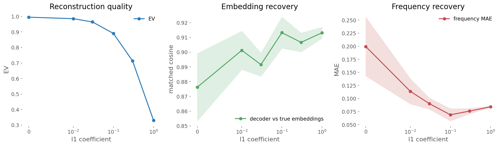

Частоты `true vs recovered`:

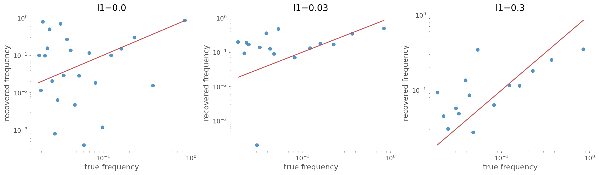

Recovery как функция параметров модели:

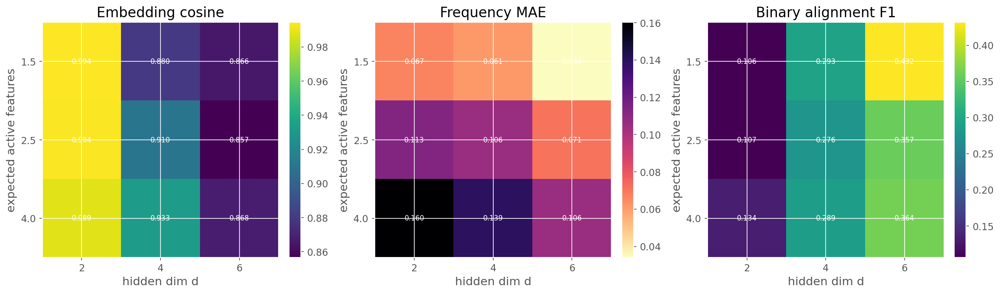

Наблюдения по `l1`:

- При `l1 = 0` reconstruction почти идеальна (`EV = 0.995`), но recovery частот плохой: `frequency MAE = 0.199`, `mean F1 = 0.171`.
- Малый штраф резко помогает recovery: при `l1 = 0.01` получаем `embedding cosine = 0.901`, `frequency MAE = 0.114`, `mean F1 = 0.299`.
- В районе `l1 = 0.03 - 0.1` возникает лучший компромисс. При `l1 = 0.03` `EV = 0.965`, `frequency MAE = 0.090`; при `l1 = 0.1` `EV = 0.890`, но `frequency MAE` падает ещё ниже до `0.069`.
- Слишком большой штраф (`0.3` и особенно `1.0`) продолжает ухудшать `EV`, а recovery частот уже не улучшает. То есть после умеренного разреживания начинается недообучение.

Наблюдения по параметрам модели:

- Уменьшение superposition сильно помогает recovery. Для `E[||f||_0] = 2.5` при росте `d: 2 -> 4 -> 6` имеем:
  - `frequency MAE: 0.113 -> 0.106 -> 0.071`
  - `mean F1: 0.107 -> 0.276 -> 0.357`
- Рост плотности активаций усложняет recovery. При `d = 6` и `E[||f||_0]: 1.5 -> 2.5 -> 4.0` получаем `frequency MAE: 0.034 -> 0.071 -> 0.106`.
- Важный нюанс: при сильной superposition (`d = 2`) cosine между декодером SAE и истинными эмбеддингами формально очень высокий (`~0.99`), но это не означает хорошее восстановление фичей. Напротив, `mean F1` там минимален (`~0.11-0.13`), потому что много истинных фичей коллапсируют в одни и те же направления.

### Вывод по части 3

Лучшее восстановление свойств модели достигается не там, где максимален `EV`, а при умеренном sparsity penalty. Небольшой `l1` заставляет SAE использовать более интерпретируемые, feature-like латенты и заметно улучшает восстановление истинных частот. Параметры самой Toy Model влияют очень существенно: чем меньше superposition и чем реже одновременно активны фичи, тем лучше SAE восстанавливает и бинарную структуру активаций, и частоты. При сильной superposition одного cosine между направлениями недостаточно, потому что несколько разных истинных фич могут сидеть почти на одном и том же луче.

## Итоговые выводы

1. Геометрия Toy Model в первую очередь управляется уровнем superposition `F / d`, а не только формой степенного закона.
2. `EV` хорошо измеряет качество реконструкции hidden states, но не гарантирует recovery истинных фичей.
3. Для SAE основной trade-off задаёт `l1`: меньше `l1` даёт лучший reconstruction, умеренный `l1` даёт лучший recovery, слишком большой `l1` ломает и то и другое.
4. Снижение superposition и уменьшение `E[||f||_0]` заметно улучшают восстановление частот и селективность латентов.
5. При анализе recovery нельзя смотреть только на cosine между эмбеддингами: в сильно суперпозиционном режиме он может быть высоким даже при плохом восстановлении отдельных фичей.

## Файлы

- Код модели и метрик: `toy_sae.py`
- Сценарий экспериментов: `run_experiments.py`
- Сводный отчёт: `report.md`
- Графики: `artifacts/figures`
- Таблицы и summary json: `artifacts/results`

## Как воспроизвести

```bash
python3 -m venv .venv
. .venv/bin/activate
python -m pip install -r requirements.txt
python run_experiments.py
```

После запуска все графики и таблицы будут пересозданы в `artifacts/`.
